

        <h1>P2P Voice Call Application</h1>
        <h2> Farbod Azimmohseni 810100187</h2>
        <h2> Seyyed Ahmad Rokni Hoseini 810100154</h2>
        
 using WebRTC and QT Creator 

        
این برنامه توسط دو فریم وورک QT Creator و WebRTC نوشته شده است و به وسیله آن می توان 
        .تماس صوتی بین دو دستگاه ایجاد کرد
        

         
        
در ادامه توضیحات لازم هر فایل و کارهایی که برای نوشتن این برنامه انجام داده ایم آمده است
        

        <h2> 
        WebRTC
        </h2>
        

        این کتابخانه که توسط گوگل توسعه داده شده هسته اصلی برقراری ارتباط در این برنامه هست.
        این کتابخانه بدون هیچ افزونه و پلاگینی می تواند ارتباط RealTime را برای ما ایجاد کند.
        برای فهمیدن نحوه کار این کتابخانه لازم است ابتدا دو پروتکل اصلی که در این کتابخانه استفاده شده اند یعنی SDP و ICE را بررسی کنیم.
        

        <ul>
                <li>
                        

                                <h3>ICE</h3>
                                
 یا به طور کامل Interactive Connectivity Establishment protocol پروتکلی است که به وسیله آن کانکشن بین دو دستگاه ایجاد می شود.
                                مزیت این روش این است که موانعی مثل 
                                <a href = 'https://www.digitalsamba.com/blog/ice-and-sdp-in-webrtc#:~:text=NAT%2C%20short%20for%20Network%20Address%20Translator'> NAT </a>
                                 و
                                <a href = 'https://www.digitalsamba.com/blog/ice-and-sdp-in-webrtc#:~:text=NAT%2C%20short%20for%20Network%20Address%20Translator' > firewall </a>
                                 که از ارتباط مستقیم دو دستگاه جلوگیری می کنند را بر می دارد.
                                

                                 
                                

                                این روش بدین صورت عمل می کند که طرفین ارتباط با اشتراک گذاری مسیرهایی که می توانند با هم ارتباط برقرار کنند ( که به هر کدام یک candidate گفته می شود) بهترین مسیر برای برقراری ارتباط را تشخیص می دهند و با حذف موانع ذکر شده در بالا با هم ارتباط را برقرار می کنند.
                                

                        

                </li>
                <li>
                        

                                <h3>SDP</h3>
                                
Session Description Protocol پروتکلی است که به وسیله آن امکان ارسال فایل های چند رسانه ای در بستر WebRTC امکان پذیر می شود.
                                در واقع این پروتکل باعث ایجاد زبان مشترک بین دو دستگاه می شود و دو دستگاه با به اشتراک گذاری sdp هایشان با هم از نوع فایلی که قرار است ارسال شود ، پروتکلی که تحت آن پیام ها ارسال می شود ، codec و سایر تنظیمات لازم برای برقراری ارتباط آگاه می شوند.
                                

                        

                </li>
        </ul>
        

        پس برای ایجاد ارتباط بین دو نقطه توسط WebRTC لازم است ما اطلاعات SDP و ICE را آنها را با یکدیگر به اشتراک بگذاریم.
         
        برای این کار روش های متفاوتی وجود دارد، برای مثال در 
        <a href = 'https://github.com/paullouisageneau/libdatachannel/tree/master/examples/copy-paste'>یکی از مثال های</a>
        خود کتابخانه این کار به وسیله copy/paste انجام شده است.
         
        

        

        یکی از راه های متداول در انتقال این پیام استفاده Signaling Server است که در این پروژه همین روش استفاده شده است.
         
        Signaling Server یک سرور ساده است که به هر صورتی قابل پیاده سازی است و به وسیله آن تنها SDP و ICE ها منتقل می شوند و بعد از آن دیگر نیازی به آن در برنامه نیست.
        

        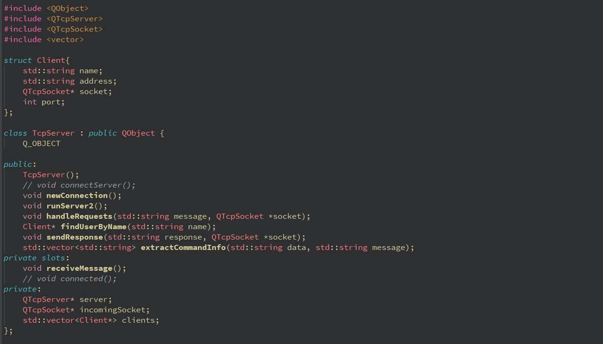
        

        ما از یک سرور TCP برای اینکار استفاده کرده ایم که لیستی از تمام کسانی که به آن وصل می شوند را نگه می دارد و این امکان را ایجاد می کند که با استفاده از سوکت به آن وصل شوند و با دانستن نام کسی که می خواهند به آن پیام دهند ، پیامشان را از طریق سرور به آن انتقال دهند.
        

        
        

        مهمترین تابع signaling_server تابع handleRequests است که در بالا آمده.
         
        این تابع بر اساس پیام ارسال شده به آنیکی دو کار ریدایرکت کردن پیام به فرد مورد نظر و اضافه کردن فرد به لیست مخاطبین سرور را انجام می دهد
        

         
        

        دو کلاس اصلی در برنامه وجود دارد که آنها answerer و offerer هستند.
        کلاس offerer کلاسی است که شروع کننده مکالمه (تماس گیرنده است ) و answerer کسی است که با آن تماس گرفته می شود.
        توابع مهم و مشترک بین این دو کلاس در زیر آمده است .
        

        

        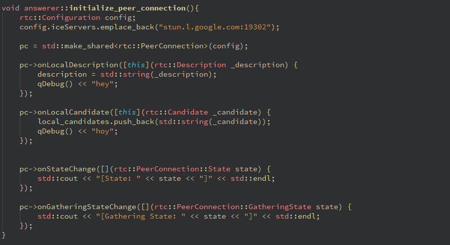
        initialize_peer_connection :
        این تابع مواردی که موقع رخ دادن برخی اتفاق ها انجام می شود را تنظیم می کند.
        البته در اینجا تنها ست کردن و چاپ کردن را انجام دادیم ولی توضیح هر کدام از عبارات در زیر آمده است 
         
        onLocalDescription : هنگامی که sdp برای خود peer مشخض می شود این تابع اجرا می شود.
         
        onLocalCandidate : هنگامی که یک مسیر کاندیدای جدید برای ICE پیدا می شود این تابع اجرا می شود 
         
        onStateChange : زمانی که حالت کانکشن عوض می شود تابع اجرا می شود . برای مثال هنگامی که استیت از connected به disconnected تغییر کند.
         
        onGatheringStateChange : عملیات gathering عملیاتی است که در طی آن دو نقطه با یکدیگر ICE candidate هایشان را به اشتراک می گذارند
        

        

        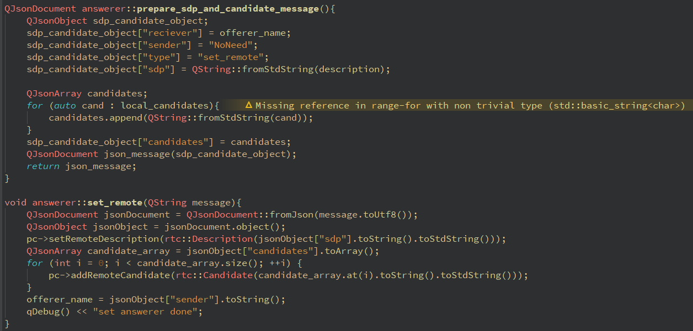
        prepare_sdp_and_candidate_message :
        این تابع پیامی که شامل SDP و ICE که باید از طریق سیگنالینگ سرور ارسال شود را آماده می کند. فرمت استفاده شده برای پیام json می باشد.
         
        set_remote : 
        پس از دریافت ICE, SDP از signalling_server آنها را برای ایجاد ارتباط در آینده نگه می داریم.
        

        

        توابعی که در زیر آمده است در دو فایل جداست و اساس کار هر کدام را نشان می دهد.
        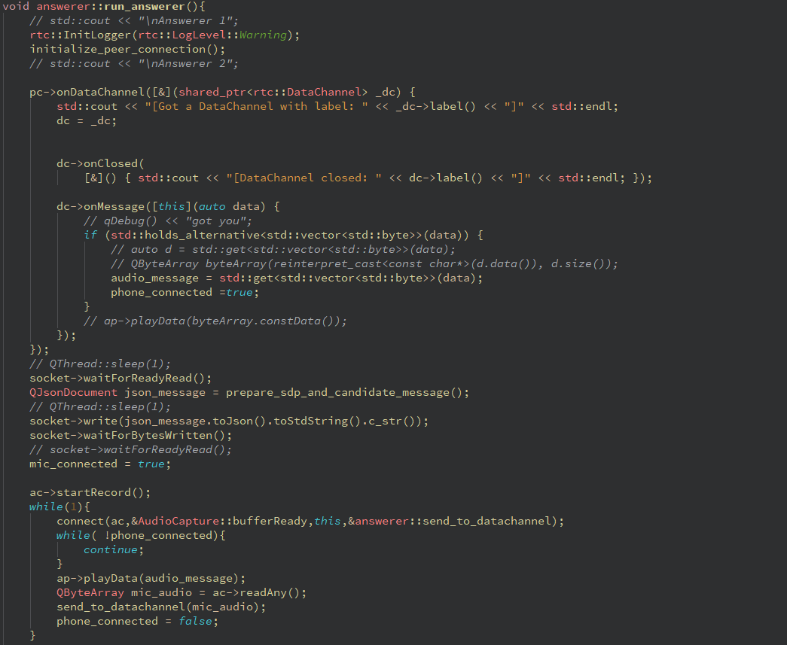
        این  تابع در فایل answerer.cpp آمده است.
         
        در ابتدا تابع initialize برای ست کردن کارهایی که در حین رخ دادن رویدادهای گفته شده باید انجام شود  اجرا می شود.
         
        از آنجایی که این تابع برای کسی اجرا می شود که تماس با او گرفته شده است، پس از datachannel ای که تماس گیرنده باز کرده استفاده می شود.
         
        پس از آن منتظر می ماند تا offerer SDP و ICE اش رو برای آنن ارسال کند.
         
        در مرحله بعدی answerer هم SDP و ICE اش رو برای offerer ارسال می کند.
         
        در این مرحله کانکشن ایجاد و دیتا چنل ایجاد می شود حال دیتاهای ضبط شده برای طرف مقابل ارسال ، و دیتاهای دریافت شده پخش می شوند.
        

        
        این تابع در فایل offerer.cpp است.
         
        مانند بالا ابتدا تابع initialize اجرا می شود. در مرحله بعدی چون offerer است باید دیتاچنل را ایجاد کند (در ادامه کد این تابع هم آمده است).
         
         <h2> Data Channel</h2>
        

        برای ایجاد یک datachannel در webrtc لازم است که در  ابتدا sdp و candidates که اطلاعات لازم برای ایجاد یک ارتباط p2p به peer مقابل فرستاده شود. 
        برای این application  در ابتدا offerer یا تماس گیرنده یک  datachannel به صورت زیر ایجاد میکند:
        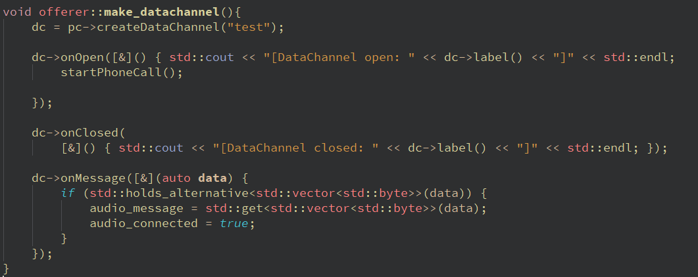
        وقتی datachannel ساخته می شود پیام sdp توسط سرور به answerer فرستاده می شود.
        هنگامی که ارتباط peer ها برقرار شد، کد سمت answerer نیز این datachannel را پیدا می کند و به آن وصل می شود:
        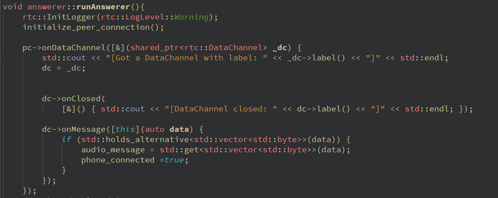
        در نهایت وقتی که ارتباط از طریق datachannel برقرار شد خروجی زیر چاپ می شود.
        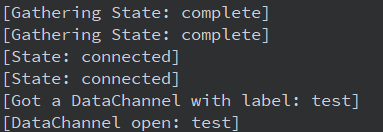
        

        حال که ارتباط برقرار شد می توان با کد زیر پیام صوتی را از میکروفون گرفته و به طرف دیگر منتقل کرد.
        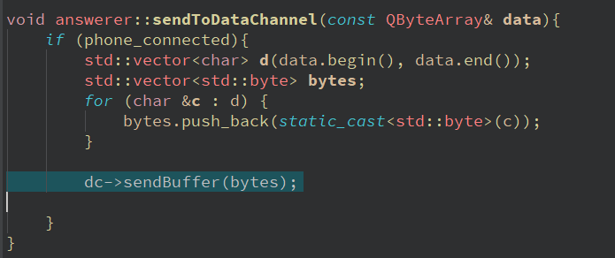
        

        در نهایت وقتی پیامی به سمت دیگر فرستاده می شود عبارت dc->onMessage
        صدا زده میشود و پیام به این شکل در هر طرف قابل دریافت می باشد.
        

        

        پیام sdp که منتقل می شود به فرمت json و به صورت زیر است که شامل candidates و sdp و نام فرستنده و گیرنده می باشد.
        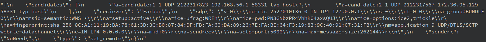
        

        <h2> Audio Input/Output</h2>
        

        در این پروژه از دو کتابخانه QAudioSource و QAudioSink برای دریافت و پخش صدا استفاده شد داده ها به صورت زیر در یک QByteArray ذخیره شده و وقتی که بافر پر شد یک سیگنال اعلام میکند که بافر قابل خواندن است. دریافت صداو تبدیل آن به بافر بر عهده کد زیر است:
        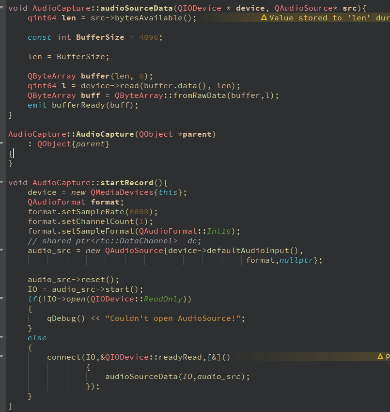
        علاوه بر این پس از دریافت یک vector از datachannel که همان صدای فرستاده شده است با استفاده از کد زیر می توان آن را پخش کرد:
        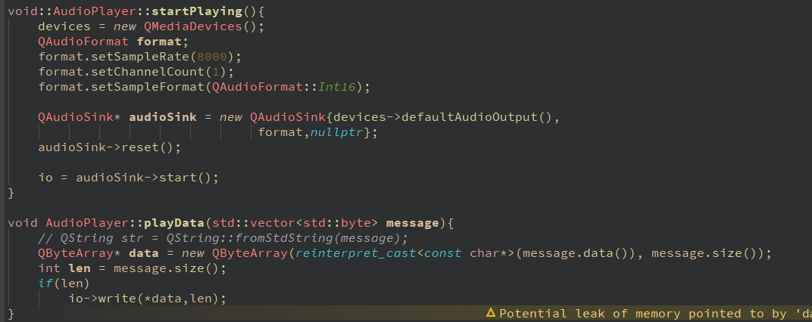
        <h2> Application</h2>
        در نهایت خروجی application به صورت زیر می باشد:
          offerer: 
        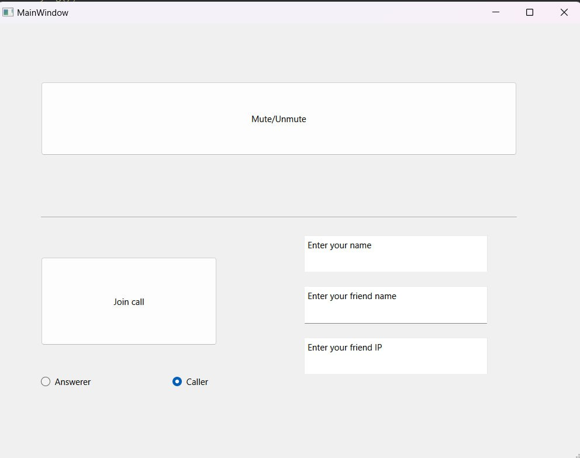
          answerer: 
        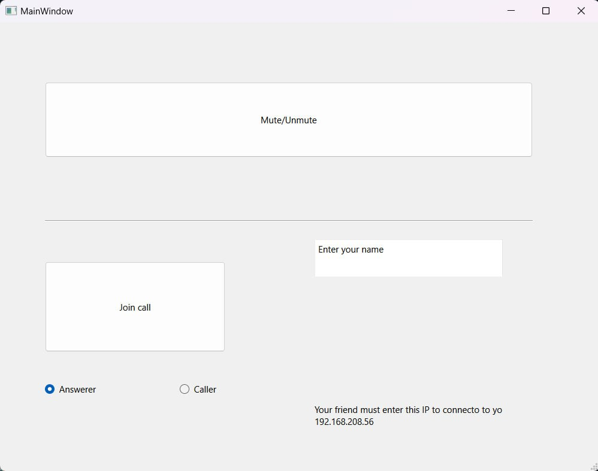

        

                

